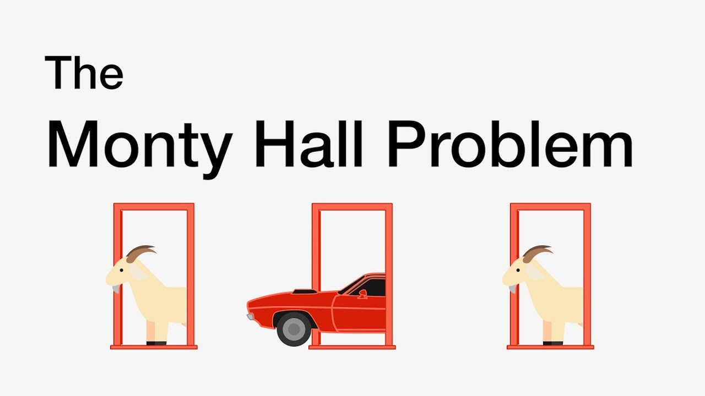

# Monty Hall Problem
The Monty Hall problem is named after Monty Hall, the host of the American television game show Let’s Make a Deal. 

In the show, contestants are asked to choose between three doors

&nbsp;

<div align="center"></div>

&nbsp;

After the contestant chose a door, Monty Hall, who knew what was behind each door, would reveal a goat behind one of the two remaining doors. The contestant was then given the option to either stick with their original choice or switch to the other unopened door.

This repository simulates playing the game many times switching and non switching.

Watch the [Video by Brilliant](https://www.youtube.com/watch?app=desktop&v=DlphpbxNTLw) for more info.

&nbsp;

## Simulation Results

&nbsp;

<div align="center"></div>

&nbsp;

## Software Dependencies

This code uses the following libraries:
- `streamlit`: for building the user interface.
- `plotly`: for plotting the results
- `pandas`: for storing the data

## Usage
```
git clone ...
python3 -m venv my_env
source my_env/bin/activate
pip install streamlit pandas plotly
streamlit run app.py
```

This will start the local Streamlit server, and you can access the interface by opening a web browser and navigating to `http://localhost:8501`.

&nbsp;

## Topics 
```
Python | Low Code UI | Live Plotting |
Data Science | Simulation
```
&nbsp;

<hr>

&nbsp;

<div align="center">


╭━━╮╭━━━┳━━┳━━━┳━╮╱╭╮        ╭╮╱╱╭━━━┳━━━┳╮╭━┳━━━╮
┃╭╮┃┃╭━╮┣┫┣┫╭━╮┃┃╰╮┃┃        ┃┃╱╱┃╭━━┫╭━╮┃┃┃╭┫╭━╮┃
┃╰╯╰┫╰━╯┃┃┃┃┃╱┃┃╭╮╰╯┃        ┃┃╱╱┃╰━━┫╰━━┫╰╯╯┃┃╱┃┃
┃╭━╮┃╭╮╭╯┃┃┃╰━╯┃┃╰╮┃┃        ┃┃╱╭┫╭━━┻━━╮┃╭╮┃┃┃╱┃┃
┃╰━╯┃┃┃╰┳┫┣┫╭━╮┃┃╱┃┃┃        ┃╰━╯┃╰━━┫╰━╯┃┃┃╰┫╰━╯┃
╰━━━┻╯╰━┻━━┻╯╱╰┻╯╱╰━╯        ╰━━━┻━━━┻━━━┻╯╰━┻━━━╯
  


&nbsp;


<a href="https://twitter.com/BrianJosephLeko"></a> &nbsp; &nbsp; &nbsp; &nbsp; &nbsp; &nbsp; <a href="https://github.com/BrianLesko"></a> &nbsp; &nbsp; &nbsp; &nbsp; &nbsp; &nbsp; <a href="https://www.linkedin.com/in/brianlesko/"></a>

follow all of these for pizza :)

</div>


&nbsp;


